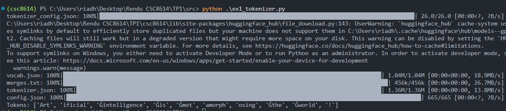

# TP1 — Modèles de langage (Transformers / GPT-2)

**Riadh Khalfallah** 

## Environnement
- **OS :** Windows 11
- **Python :** 3.10.11
- **Installation / activation :**
  ```bash
  python -m venv csc8614
  csc8614\Scripts\activate
  pip install -r TP1/requirements.txt

**Versions librairies**

transformers : 4.57.3

torch : 2.9.1

numpy : 2.2.6

scikit-learn : 1.7.2

plotly : 6.5.1

tqdm : 4.67.1


# Exercice 2 : Découverte du tokenizer GPT-2

**ex1**
```
Tokens: ['Art', 'ificial', 'Ġintelligence', 'Ġis', 'Ġmet', 'amorph', 'osing', 'Ġthe', 'Ġworld', '!']
```

GPT-2 utilise une tokenisation BPE où l’espace est encodé directement dans certains tokens via un 

caractère spécial (Ġ).

Un token qui commence par Ġ signifie donc qu’il apparaît après un espace dans le texte donc début de mot.

Ce qui aide à mieux modéliser les frontières de mots sans ajouter un token “espace” séparé à chaque fois.




| Token (décodage) | ID | Remarque |
|---|---:|---|
| 'Art' | 8001 | début de "artificial" |
| 'ificial' | 9542 | suite du mot |
| ' intelligence' | 4430 | espace inclus |
| ' is' | 318 | espace inclus |
| ' met' | 1138 | espace + sous-mot (début “metamorphosing”) |
| 'amorph' | 37670 | morceau interne |
| 'osing' | 2752 | suffixe |
| ' world' | 995 | espace inclus |
| '!' | 0 | ponctuation séparée |


**Différence tokens et token IDs**

Les tokens = morceaux de texte (souvent sous-mots).

Les token IDs = indices numériques de ces tokens dans le vocabulaire (entrée du modèle).


**Observations concrètes**

`1- Les mots sont souvent découpés en sous-mots`
Le mot Artificial est représenté par deux tokens : Art et ificial. GPT-2 ne garde donc pas toujours les mots entiers mais les fragmente en unités fréquentes.

`2- La ponctuation`
Le symbole "!" est traité comme un token indépendant, ce qui permet au modèle de gérer séparément la ponctuation.

`3- Les espaces `
Les tokens commençant par Ġ correspondent à des mots précédés d’un espace. L’espace n’est donc pas un token séparé mais fait partie du token suivant.

Ces comportements illustrent le principe du Byte Pair Encoding (BPE) : le texte est représenté par des sous-mots fréquents plutôt que par des mots complets.
Les fragments comme Art, met, ou osing peuvent être réutilisés pour construire de nombreux mots, ce qui permet au modèle de gérer efficacement les mots rares tout en conservant un vocabulaire limité.


**Phrase 2**
['G', 'PT', 'Ġmodels', 'Ġuse', 'ĠB', 'PE', 'Ġtoken', 'ization', 'Ġto', 'Ġprocess', 'Ġunusual', 'Ġwords', 'Ġlike', 'Ġant', 'idis', 'establishment', 'arian', 'ism', '.']
**Nombre de sous-tokens pour antidisestablishmentarianism** = 5 
['Ġant', 'idis', 'establishment', 'arian', 'ism']

Le mot antidisestablishmentarianism est très long et peu fréquent : GPT-2 ne l’a généralement pas comme un seul token.
Avec BPE, le tokenizer le découpe en plusieurs sous-mots (préfixes/suffixes et fragments fréquents) qui existent dans le vocabulaire.
Cela permet de représenter des mots rares en réutilisant des morceaux connus, tout en gardant un vocabulaire de taille raisonnable et en généralisant à des mots jamais vus exactement pendant l’entraînement.


# Exercice 3 : Analyse des encodages positionnels dans GPT-2

- Torch.Size([1024, 768])

Interprétation :

- 1024 = nombre de positions possibles (positions 0 à 1023) pour lesquelles GPT-2 a appris un vecteur positionnel.

- 768 = dimension de chaque vecteur d’encodage positionnel (même dimension que les embeddings de tokens, n_embd), qui sera additionné à l’embedding du token.


n_positions correspond à la longueur maximale de contexte que GPT-2 peut traiter : le modèle ne dispose d’embeddings appris que pour 1024 positions. Pour un modèle de langage causal, cela signifie qu’il peut conditionner sa prédiction sur au plus 1024 tokens.

**positions 0–50**


**Observation du nuage de points**

Le nuage de points forme une trajectoire continue : les positions successives suivent une courbe lisse et restent proches, ce qui indique une évolution régulière des embeddings avec l’indice de position. On remarque aussi un point isolé, très éloigné du groupe principal, suggérant une position avec une représentation atypique dans cette projection. Globalement, la structure n’est pas aléatoire : elle reflète un encodage cohérent de l’ordre des tokens.


**PCA**

Les embeddings positionnels de GPT-2 sont initialement en dimension 768, ce qui empêche toute visualisation directe. La PCA permet de projeter ces vecteurs dans un espace 2D tout en conservant un maximum de variance. Elle rend ainsi visibles les relations globales entre positions  Sans la PCA, il serait impossible d’interpréter visuellement la structure géométrique des encodages positionnels.


**positions 0–200**


**Comparaison**

Pour les positions 0–50, la trajectoire est courte et très lisible : la continuité entre positions successives est claire et la structure apparaît simple et régulière.
Pour les positions 0–200, la structure devient beaucoup plus étendue : on observe une grande courbe en forme d’arc, avec une densité de points plus élevée et une trajectoire plus longue. L’échelle plus large rend la visualisation moins locale mais plus globale : la continuité est toujours présente, mais la lecture des positions individuelles devient moins intuitive.

En résumé, l’augmentation de l’échelle révèle la structure globale des encodages positionnels, mais au prix d’une lisibilité plus faible des relations locales.


**Hypothèse**

Ces résultats suggèrent que les embeddings positionnels de GPT-2 ne codent pas simplement la position sur un axe linéaire, mais selon une structure géométrique continue et non linéaire dans l’espace des embeddings. Les positions proches restent similaires localement, tandis que les positions éloignées suivent une trajectoire globale cohérente. La projection PCA montre que la représentation des positions est organisée comme un chemin continu dans l’espace latent. Cela permet au modèle de distinguer l’ordre des tokens tout en conservant une régularité dans la transition entre positions.

# Exercice 4: Probabilités et génération de texte avec GPT-2

```

1 'ificial' 1.920e-05
2 ' intelligence' 1.505e-01
3 ' is' 1.955e-01
4 ' fascinating' 6.504e-04
5 '.' 1.773e-01

```

Dans GPT-2 (modèle causal), la sortie au pas i prédit le token suivant.Les logits[0, t-1, :] correspondent donc à la distribution prédite après avoir lu les tokens jusqu’à la position t-1, c’est-à-dire la probabilité du token effectivement observé en position t.On utilise donc probs[0, t-1, tok_id] pour obtenir la probabilité P(xt|x< t).

```

total_logp: -23.45
perplexity: 108.96

```

La perplexité mesure à quel point le modèle “est surpris” par une séquence, plus elle est faible, plus la phrase est probable selon le modèle. Elle correspond au nombre moyen de choix plausibles que le modèle hésite entre à chaque token . De plus, elle est l’exponentielle de la moyenne de la négative log-probabilité par token. Une perplexité proche de 1 signifierait que le modèle prédit presque toujours correctement le prochain token avec très forte probabilité. Une perplexité plus grande indique que le modèle attribue des probabilités plus dispersées au prochain token, donc qu’il est moins confiant.


**"Artificial intelligence is fascinating."**

perplexity: 108.96068293473512

**"Artificial fascinating intelligence is."**

perplexity: 4595.901109749812

On constate que la deuxième phrase a une perplexité presque 40 fois plus élevée que la première, ce qui indique que GPT-2 la considère comme beaucoup moins probable.

GPT-2 attribue une perplexité plus faible aux phrases qui respectent les régularités grammaticales apprises lors de l’entraînement. La première phrase suit une structure syntaxique courante (sujet + verbe + adjectif), ce qui rend les transitions entre tokens plus probables.Tandis que, la deuxième phrase présente un ordre de mots peu naturel, ce qui rend plusieurs prédictions conditionnelles improbables. Comme la perplexité est basée sur la moyenne des log-prob conditionnelles, quelques tokens très improbables suffisent à augmenter fortement la perplexité. Cela montre que GPT-2 capture non seulement le vocabulaire, mais aussi les structures grammaticales et statistiques du langage.


**"L'intelligence artificielle est fascinante."**

perplexity: 383.04

`Comparaison`

La perplexité de la phrase française est plus élevée que celle de la phrase anglaise correcte, mais beaucoup plus faible que celle de la deuxième phrase anglaise Cela montre que GPT-2 reconnaît partiellement la structure de la phrase française, mais reste moins confiant que pour une phrase anglaise bien formée.

`Explication`

GPT-2 a été entraîné majoritairement sur des données en anglais, ce qui rend les phrases françaises moins probables selon sa distribution interne. Les mots français sont souvent découpés en sous-tokens plus rares, et les structures syntaxiques françaises apparaissent moins fréquemment dans les données d’entraînement. Néanmoins, la perplexité reste bien inférieure à celle de la phrase anglaise incorrecte, ce qui indique que le modèle reconnaît une cohérence linguistique générale. Cette expérience montre que la perplexité dépend fortement de la langue et de la distribution des données d’apprentissage du modèle.

**Les 10 propositions**

```

' a' 1.205e-01
' the' 5.254e-02
' not' 4.324e-02
' an' 3.092e-02
' now' 2.062e-02
' one' 1.890e-02
' also' 1.880e-02
' already' 1.716e-02
' becoming' 1.606e-02
' just' 1.422e-02


```

Les tokens proposés sont plausibles car ils correspondent à des continuations naturelles d’une phrase commençant par “Artificial intelligence is”. On observe principalement des déterminants (' a', ' the', ' an') et des adverbes ou verbes (' becoming', ' already', ' also', ' just') qui permettent de construire une suite grammaticale cohérente.

Tous les tokens commencent par un espace, ce qui est normal avec la tokenisation GPT-2 où l’espace est intégré au token suivant. L’ensemble montre que GPT-2 privilégie des structures syntaxiques fréquentes et grammaticalement correctes plutôt que des mots isolés ou incohérents.

# Exercice 5 : Exploration des méthodes de génération avec GPT-2


**Seed = 42**


On fixe un seed pour rendre les expériences reproductibles dont la génération dépend de tirages pseudo-aléatoires et on peut relancer et obtenir les mêmes sorties à paramètres identiques, ce qui facilite la comparaison entre méthodes.

**Texte généré 1**
```
The future of artificial intelligence is uncertain.

"We're not sure what the future will look like," said Dr. Michael S. Schoenfeld, a professor of computer science at the University of California, Berkeley. "But we're not
```

**Texte généré 2**

```
The future of artificial intelligence is uncertain.

"We're not sure what the future will look like," said Dr. Michael S. Schoenfeld, a professor of computer science at the University of California, Berkeley. "But we're not

```

**Texte généré 3** SEED 1

```

The future of artificial intelligence is uncertain.

"We're not sure what the future will look like," said Dr. Michael S. Schoenfeld, a professor of computer science at the University of California, Berkeley. "But we're not

```

En relançant 3 fois la génération avec le décodage glouton, le texte obtenu est strictement identique. Cela s’explique par le fait que le greedy decoding est une méthode déterministe dont à chaque étape, le modèle choisit toujours le token ayant la probabilité maximale.


**SEED 1**

```
The future of artificial intelligence is up in the air, and the future of artificial intelligence is now about to change. For now, we're just waiting for the technology to be perfected so that we can take it to the next level.

```

**SEED 2**

```
The future of artificial intelligence is not clear, but that could change. The early progress of AI has been largely due to the ability to do some things fairly quickly, like calculate things, but the future is not clear. The early progress of AI has
```

**SEED 3**

```
The future of artificial intelligence is bright and bright. The future of the Internet of Things, and the future of the future of the Internet of Things industry.

The future of the Internet of Things, and the future of the Internet of Things industry
```

**Comparaison avec greedy**

Par rapport au greedy decoding, le sampling produit des textes nettement plus variés où chaque seed génère une continuation différente, tant sur le contenu que sur le style. La cohérence globale est généralement conservée, mais on observe plus de répétitions locales et parfois des formulations moins naturelles. Le greedy fournit un texte plus stable et structuré, mais plus prévisible et générique. Le sampling, en revanche, favorise la créativité et la diversité, au prix d’une légère perte de précision grammaticale et de cohérence à long terme.


**Rôle des paramètres**

- Température (0.7) : rend la distribution moins aléatoire qu’à 1.0, ce qui limite les choix trop improbables tout en conservant de la diversité.

- Top-k = 50 : le modèle ne peut choisir que parmi les 50 tokens les plus probables, ce qui évite des mots incohérents.

- Top-p = 0.95 : le tirage se fait dans un ensemble dynamique de tokens couvrant 95 % de la probabilité cumulée, ce qui adapte automatiquement la diversité selon le contexte.

**Sans pénalité**

```
The future of artificial intelligence is bright and bright. The future of the Internet of Things, and the future of the future of the Internet of Things industry.

The future of the Internet of Things, and the future of the Internet of Things industry

```

**Avec pénalité**

```
The future of artificial intelligence is bright and exciting. We need a way to capture that information, but it has been very challenging for us," said James Pritchard from the University's Centre on Artificial Intelligence (CAI), who was not involved in


```

**Commentaire**

Avec penalty=2, on observe moins de répétitions où la version sans pénalité répète plusieurs segments (“bright and bright”, “future of the future”, répétition de “The future of the Internet of Things”) et le texte devient plus varié et évite ces boucles.
En contrepartie, un effet secondaire possible est une continuation parfois moins stable car le modèle est forcé d’éviter des tokens déjà utilisés même s’ils seraient naturellement réutilisés.


**Sortie température 1**

```
The future of artificial intelligence is uncertain, but it is clear that it will be a big part of the future of the human race.

The future of artificial intelligence is uncertain, but it is clear that it will be a big part of the


```

**Sortie température 2**

```
The future of artificial intelligence is not something that will define it or how and when society uses AI at every step of your job," Musk revealed Sunday on Time Out Europe with Daniel Zaizner.
"Our main takeaway is very slowly we will hit


```

**Compromis cohérence vs diversité**

Une température basse =1 rend la distribution très pointue dont le modèle choisit presque toujours des tokens très probables. Le texte est donc généralement plus cohérent, plus grammatical et plus proche du greedy, mais aussi moins divers et plus générique.
À l’inverse, une température élevée =2 aplatit la distribution dont des tokens moins probables deviennent beaucoup plus accessibles. Cela augmente fortement la diversité et l’originalité, mais la génération peut devenir moins stable, avec plus de risques d’incohérences ou de phrases moins naturelles. La température contrôle donc directement le compromis entre cohérence et diversité.


**Sortie beam search**

```
The future of artificial intelligence is in the hands of the next generation of scientists and engineers.

The future of artificial intelligence is in the hands of the next generation of scientists and engineers.

The future of artificial intelligence is in the hands of

```

**Comparaison qualitative**

Le beam search produit en général une séquence plus probable globalement que le greedy, car il explore plusieurs continuations et sélectionne celle qui maximise la probabilité totale de la phrase. Dans notre cas, la sortie est très générique et prudente, et surtout moins diverse où à paramètres identiques, on obtient la même génération à chaque exécution contrairement au sampling. On observe aussi un effet fréquent du beam search dont il peut amplifier les répétitions ou boucler sur des phrases très probables, comme ici où la même phrase est répétée. 


**Temps mesurés**

- num_beams = 5 : 2.024 s

- num_beams = 10 : 2.761 s

- num_beams = 20 : 3.155 s


On observe que le temps augmente quand on augmente le nombre de beams : de 5 à 10 beams, le temps augmente nettement, puis de 10 à 20 l’augmentation reste présente mais plus modérée.

**Ralentissement**

Le beam search maintient plusieurs beams en parallèle. À chaque token généré, le modèle doit évaluer et comparer plus de continuations, puis sélectionner les meilleurs chemins. Le coût de calcul augmente donc avec num_beams et aussi avec la longueur générée, car on explore plus de trajectoires candidates avant de choisir la meilleure séquence globale.