# TP 4 : Retrieval-Augmented Generation (RAG)


## Exercice 1 : Démarrage d'Ollama en local

**Port utilisé : 11434**

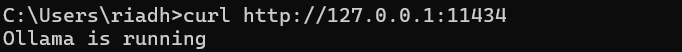

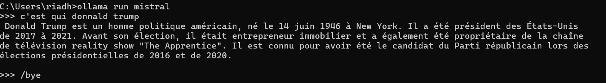

## Exercice 2 : Constituer le dataset (PDF administratifs + emails IMAP) et installer les dépendances

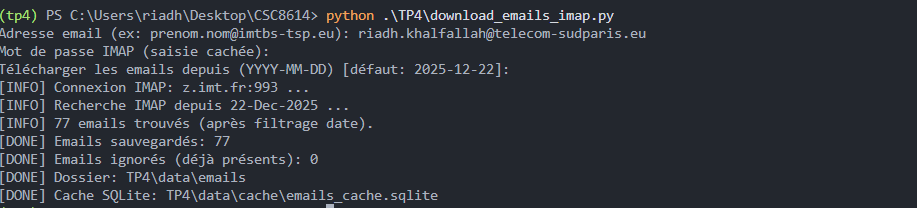

nbre de fichiers crées 77

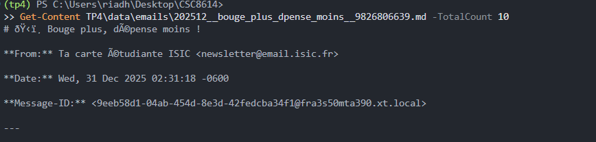

## Exercice 3 : Indexation : charger PDFs + emails, chunker, créer l’index Chroma (persistant)


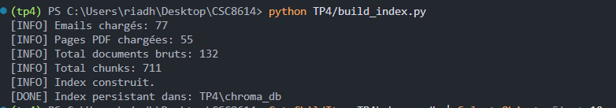

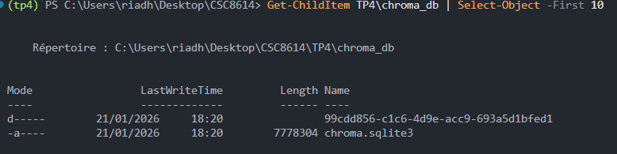

## Exercice 4 : Retrieval : tester la recherche top-k (sans LLM) et diagnostiquer la qualité

**python TP4/test_retrieval.py "Comment valider une UE ?"**

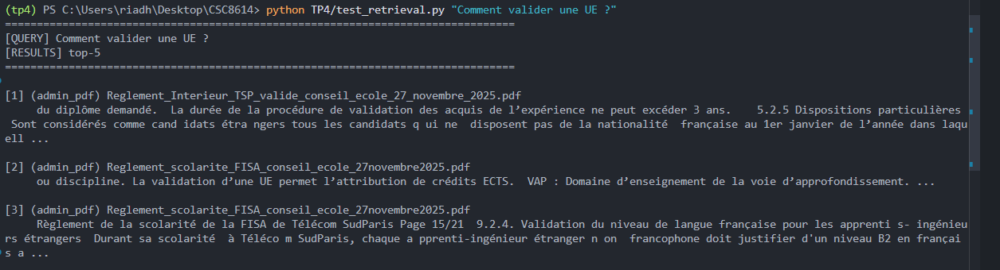


**python TP4/test_retrieval.py "Quand auront lieu les travaux à l’entrée du campus ?"**

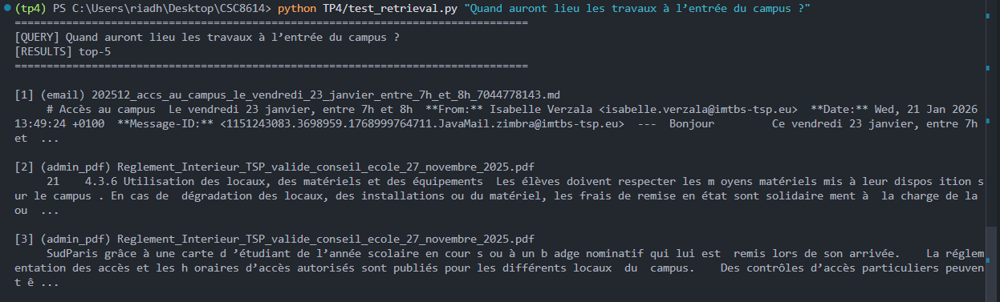

**TOP_K = 5**


## Exercice 5 : RAG complet : génération avec Ollama + citations obligatoires


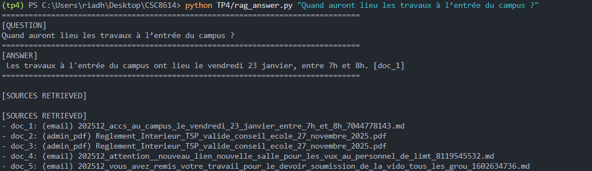

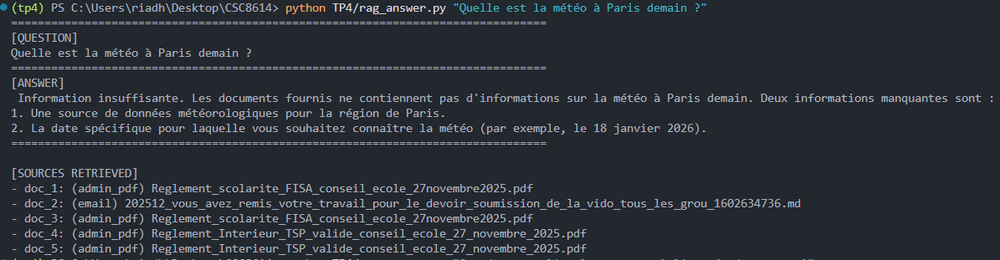

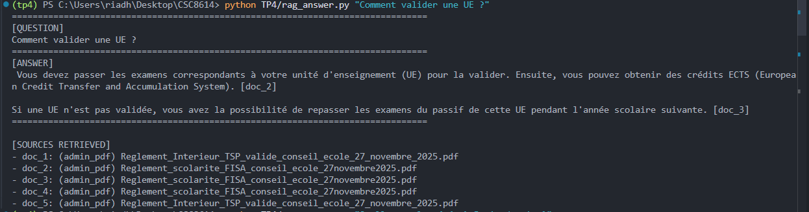

## Exercie 6 :

**Extrait questions.json**

```

[
  {
    "id": "q1",
    "question": "Le parking visiteurs est-il accessible pendant les travaux à l’entrée du campus ?",
    "expected_doc_type": "email"
  },
  {
    "id": "q2",
    "question": "Comment valider une UE dans la formation FISA à Télécom SudParis ?",
    "expected_doc_type": "admin_pdf"
  },
  {
    "id": "q3",
    "question": "Quelles sont les règles concernant l’assiduité des apprentis-ingénieurs ?",
    "expected_doc_type": "admin_pdf"
  },
  {
    "id": "q4",
    "question": "Quelles sont les conséquences d’une absence non justifiée à un examen ?",
    "expected_doc_type": "admin_pdf"
  },
  {
    "id": "q5",
    "question": "Quelles sont les modalités d’inscription au TOEIC de janvier 2026 ?",
    "expected_doc_type": "email"
  },
  {
    "id": "q6",
    "question": "L’examen du TOEIC est-il gratuit et comment se déroule-t-il ?",
    "expected_doc_type": "email"
  },
  {
    "id": "q7",
    "question": "Quelles dates ma tutrice propose-t-elle pour le rendez-vous de visite d'entreprise ?",
    "expected_doc_type": "email"
  },
  {
    "id": "q8",
    "question": "Quelles sont les obligations des étudiants avant une soutenance finale du module rse?",
    "expected_doc_type": "email"
  },
  {
    "id": "q9",
    "question": "Quels sont les sujets de PFE supplémentaires proposés par Luca Benedetto ?",
    "expected_doc_type": "email"
  }
]
```

**Output python TP4/eval_recall.py**

```
================================================================================
[EVAL] proxy Recall@5 (doc_type attendu dans top-k)
================================================================================

[q1] Le parking visiteurs est-il accessible pendant les travaux à l’entrée du campus ?
  expected: email
  got: ['email', 'email', 'admin_pdf', 'admin_pdf', 'email']
  hit: True

[q2] Comment valider une UE dans la formation FISA à Télécom SudParis ?
  expected: admin_pdf
  got: ['admin_pdf', 'admin_pdf', 'admin_pdf', 'admin_pdf', 'admin_pdf']
  hit: True

[q3] Quelles sont les règles concernant l’assiduité des apprentis-ingénieurs ?
  expected: admin_pdf
  got: ['admin_pdf', 'admin_pdf', 'admin_pdf', 'admin_pdf', 'admin_pdf']
  hit: True

[q4] Quelles sont les conséquences d’une absence non justifiée à un examen ?
  expected: admin_pdf
  got: ['admin_pdf', 'admin_pdf', 'admin_pdf', 'admin_pdf', 'admin_pdf']
  hit: True

[q5] Quelles sont les modalités d’inscription au TOEIC de janvier 2026 ?
  expected: email
  got: ['admin_pdf', 'admin_pdf', 'email', 'email', 'email']
  hit: True

[q6] L’examen du TOEIC est-il gratuit et comment se déroule-t-il ?
  expected: email
  got: ['email', 'admin_pdf', 'admin_pdf', 'admin_pdf', 'admin_pdf']
  hit: True

[q7] Quelles dates ma tutrice propose-t-elle pour le rendez-vous de visite d'entreprise ?
  expected: email
  got: ['email', 'email', 'email', 'email', 'email']
  hit: True

[q8] Quelles sont les obligations des étudiants avant une soutenance finale du module rse?
  expected: email
  got: ['admin_pdf', 'admin_pdf', 'admin_pdf', 'admin_pdf', 'email']
  hit: True

[q9] Quels sont les sujets de PFE supplémentaires proposés par Luca Benedetto ?
  expected: email
  got: ['email', 'email', 'admin_pdf', 'email', 'email']
  hit: True

--------------------------------------------------------------------------------
[SCORE] 9/9 = 1.00
--------------------------------------------------------------------------------

```
**Evaluation qualitaitive**

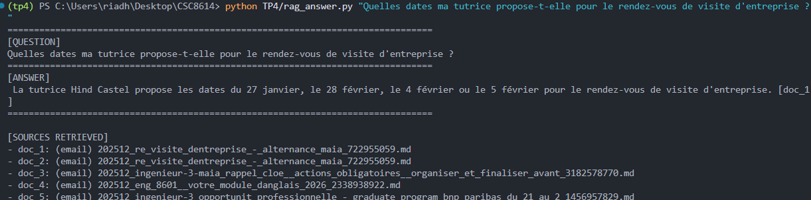

- Visite d’entreprise : disponibilités tutrice : **1/2**
  
  La source email est correcte ([doc_1]) mais la réponse est incomplète (dates manquantes et confusion 
  
  sur 28 février au lieu de 28 janvier).

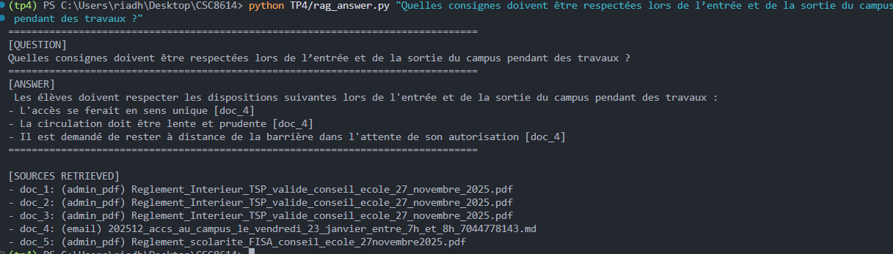

- Travaux campus (consignes entrée/sortie) : **2/2**

  Réponse correcte, concise et actionnable ; citations cohérentes sur un email ([doc_4]).

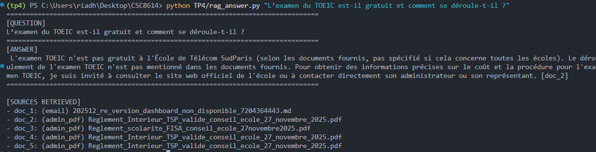

- TOEIC (gratuit + déroulement) : **0/2**

  Réponse non conforme : elle contredit le contenu de l’email : inscription gratuite et examen en ligne 
  
  et ajoute des informations externes (ETS).

### Analyse d'erreurs 

 ### Échec 1 : Question TOEIC : réponse fausse

Le modèle répond que ce n’est pas mentionné comme gratuit et parle d’ETS alors que l’email indique inscription gratuite et examen en ligne.

**Cause probable :**

Retrieval miss / bruit : l’email TOEIC n’apparaît pas dans les top-5 chunks récupérés (mauvais documents remontés).

**Corrections proposées :**

Augmenter TOP_K (10) pour augmenter les chances de récupérer l’email TOEIC.

Réduire le bruit en forcer doc_type=email pour les questions.

Renforcer le prompt : Si le contexte ne mentionne pas la gratuité (gratuit/gratuite) et le mode (en ligne/à distance/chez vous), réponds exactement : "Information insuffisante.".


### Échec 2 : Question Disponibilités tutrice : réponse partiellement fausse

Le modèle a sorti des dates incorrectes  et a oublié des créneaux  alors que la bonne source était bien récupérée.

**Cause probable :**

Erreur de génération ou d'extraction : la source est dans le contexte, mais le LLM “résume” mal : confusion de dates.

Trop de bruit : le chunk contient beaucoup de texte, le modèle perd des éléments et hallucine une date.

**Corrections proposées :**

Réduire la taille de chunk pour emails (500) afin que les lignes avec dates restent compactes et faciles à extraire.

Prompt plus strict sur les dates : “Recopie exactement toutes les dates proposées. Ne reformule pas les dates."


### Synthèse 

Le pipeline RAG mis en place fonctionne bien pour des questions factuelles lorsque l’information est présente dans le corpus dont les emails et les règlements PDF remontent correctement et les réponses générées restent sourcées par des citations. 

Le retrieval est globalement pertinent, et la politique d’abstention permet d’éviter la plupart des hallucinations quand le contexte est insuffisant. 

La principale limite rencontrée concerne le bruit et les retrieval miss par exemple annonce TOEIC non récupérée dans le top-k, ce qui entraîne des réponses incorrectes ou incomplètes malgré un bon index. 

Si je devais le déployer, l’amélioration prioritaire serait d’ajouter des garde-fous et du filtrage au retrieval  afin d’augmenter la probabilité de récupérer la bonne source avant génération.